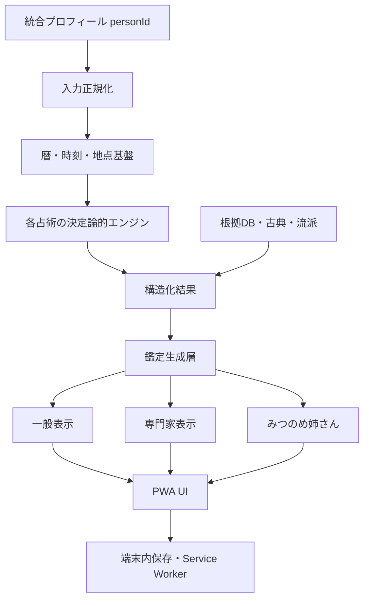

# KOYOMI Architecture

最終更新: 2026-08-05

## システム構成

KOYOMIはGitHub Pagesで配信できるPWAを基盤とし、オフラインファースト、端末内保存、決定論的エンジン、根拠表示を中核にします。

- `index.html`: 入口。公開版のトップとアプリ本体への導線。
- `today.html`: 今日の暦、今日の運勢、方位などを軽量に確認する画面。
- `app.html`: 統合アプリ本体。プロフィール、ホーム、各占術、設定を扱う。
- `service-worker.js`: 静的ファイル、エンジン、データをキャッシュし、古いキャッシュを整理する。
- `manifest.webmanifest`: PWAメタデータ、アイコン、表示モードを定義する。
- `src/`: 決定論的エンジン、共有基盤、UI補助、読み替え層。
- `data/`: 占術データ、根拠、ルール、命例。
- `tests/`: 静的検証、エンジン回帰、モバイル回帰、互換性検証。
- `docs/`: 仕様、監査、状態、リリース、運用ルール。

## データ構造

人物情報は`personId`で一元管理します。本人、家族・友人、プロ顧客はモードで分けますが、占術ごとに氏名、生年月日、出生時刻、出生地を再入力させません。

人物プロフィールの原則:

- 既存フィールドと未知フィールドを保持する。
- `isPrimaryPerson = true` の本人を標準鑑定の対象にする。
- 氏名、読み、ローマ字、原綴り、旧字体、異体字、姓名構造は内部保持し、通常画面では必要最小限だけ見せる。
- 出生地は国、地域、都市、緯度、経度、タイムゾーン、UTC、DST、精度、sourceを保持する。
- 保存は端末内を基本とし、外部送信を前提にしない。

## エンジン構成

各占術は次の層に分けます。

- 入力正規化層: 人物プロフィール、日時、地点、目的を占術入力へ変換する。
- 計算層: 決定論的に命式、盤、チャート、象意を生成する。
- ルール層: sourceIds、schoolIds、reviewStatus、confidenceを持つ判断ルール。
- 根拠層: 古典原文、要約、現代解釈、反対説を分離する。
- 鑑定生成層: 構造化結果を初心者向け/専門家向け説明へ変換する。
- 表示層: 一般表示と専門家表示を分離し、内部IDを一般表示へ出さない。

AIは計算層ではなく説明層です。AIは根拠を作るのではなく、計算済み結果と根拠を分かりやすく翻訳します。

## UI構成

UIはiPhoneファーストです。

- 1画面1目的。
- 主要操作は親指が届く位置に置く。
- タップ領域は44px相当以上。
- 入力中は下部ナビゲーションを隠す。
- Visual Viewport APIとsafe-area-insetに対応する。
- 100vh依存を避け、100dvhまたは実測viewportを使う。
- 横スクロールを禁止する。
- 一般表示では内部ID、snake_case、kebab-case、sourceId、ruleIdを出さない。
- 専門家表示では根拠、計算値、sourceId、ruleId、schoolId、generationVersionを折りたたみで示す。

## API構成

内部APIはブラウザ内で完結します。現在の主なAPI群は四柱推命、暦・時刻、プロフィール互換、読み替え、UI補助に分かれます。外部APIは将来のKOYOMI Engine提供時まで最小化します。

公開APIを設計する場合も、個人情報と計算エンジンを分離し、端末内保存と同意を優先します。

## データの流れ

## 将来連携

- Apple Watch: 今日の要点、注意時間帯、吉方位、短い根拠リンクを表示する補助画面。
- Garmin: 軽量データ同期、方位、活動量との組み合わせを将来検討する。
- KOYOMI Engine API: 個人情報を分離した計算・根拠・説明APIとして提供可能にする。
